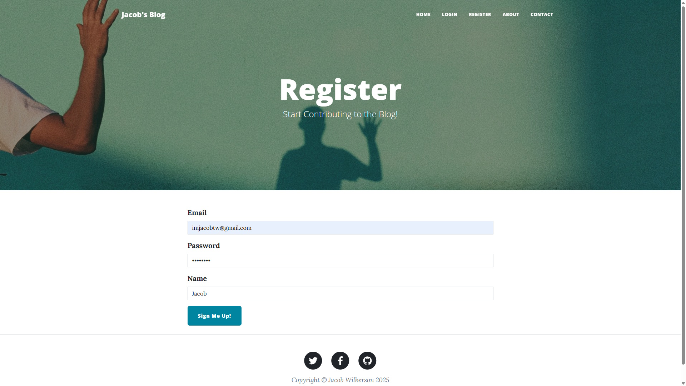
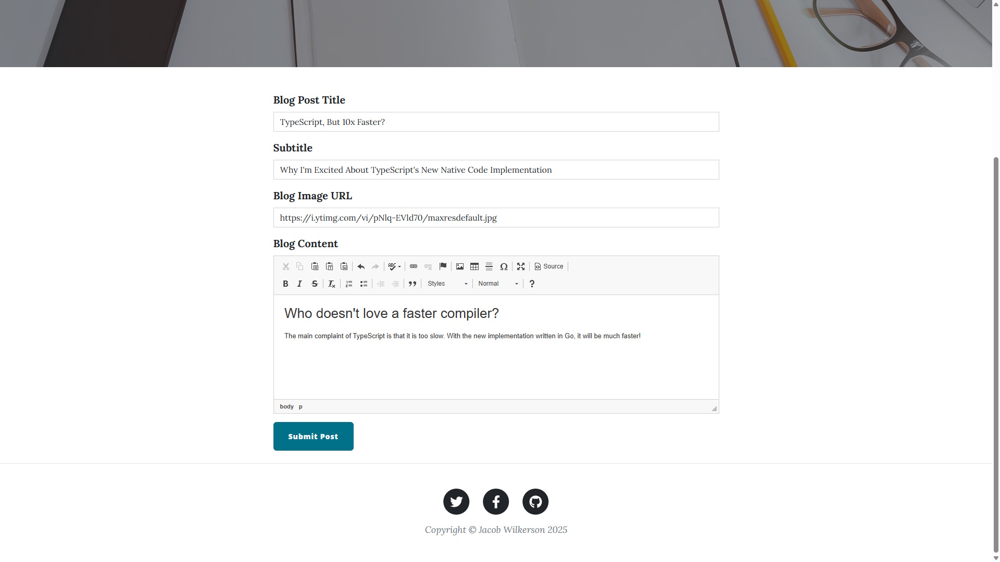
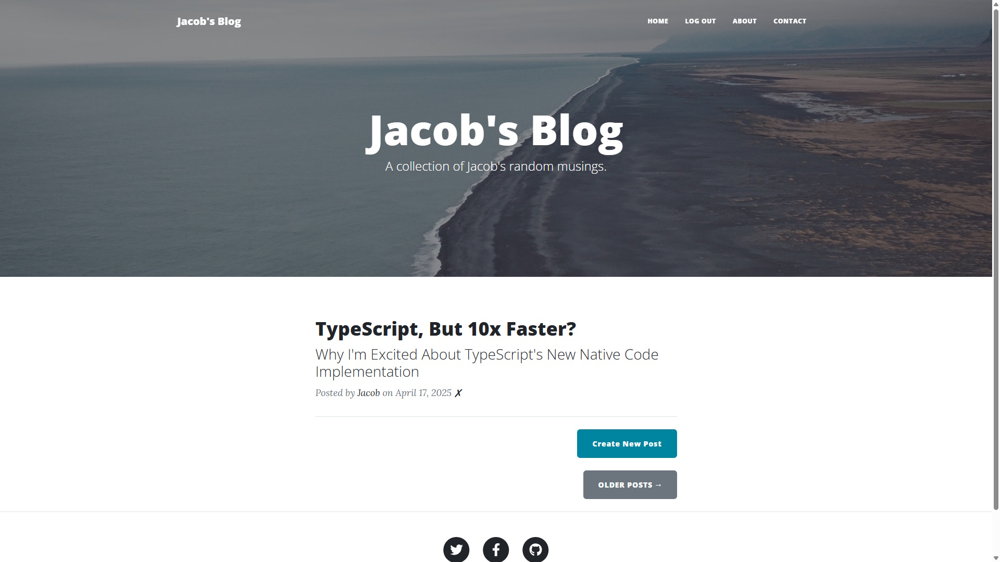
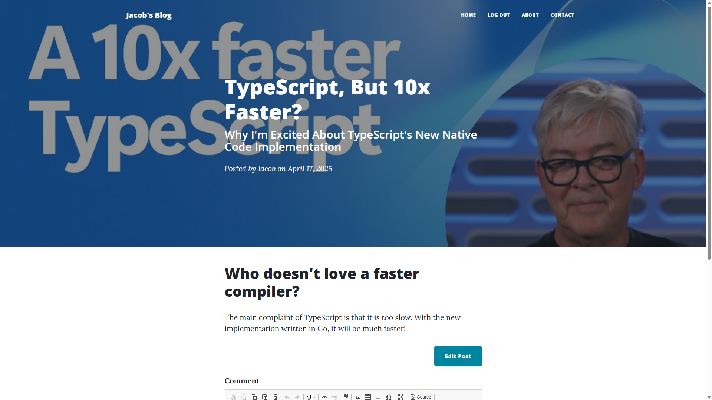
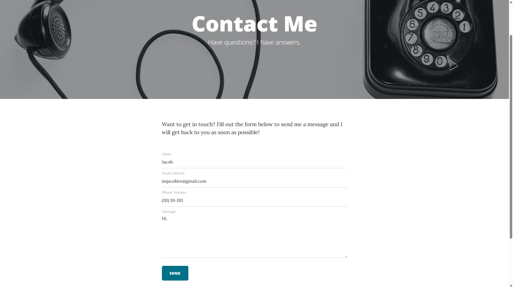

# Blog Website
## Description
A web application that allows users to post blogs. Users can edit previously submitted posts and comment on other users' blogs.

## Technologies
- Python
- Flask
- Jinja
- Bootstrap
- WTForms
- Flask Login
- RESTful APIs
- SQLite
- SQLAlchemy

## Showcase
The Register Page

Creating a Blog Post

The Home Page

Reading a Blog

Working Contact Form

